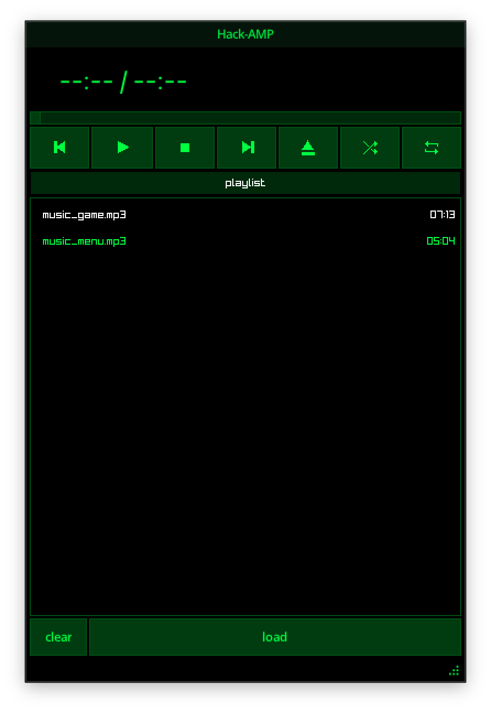

# Hack-Amp

A small and simple music player for hackers from the past.



## Features

- Plays mp3, wav, ogg and flac files
- Load single files or scan a whole folder
- Playlist with shuffle, repeat, next/previous
- Seek bar, elapsed time, track duration
- Reads artist/title/album from ID3 tags (mp3)
- Remembers your last window position and playlist (saved to `~/.hack-amp/config.ini`)

## Requirements

- [Odin](https://odin-lang.org/docs/install) (raylib and miniaudio come bundled with it)
- `clang`, `cmake` and `make`

## Install and run

```sh
git clone --recurse-submodules https://github.com/eduardonunesp/hack-amp.git
cd hack-amp
make run
```

If you cloned without `--recurse-submodules`, run this once:

```sh
git submodule update --init --recursive
```

Then use one of the targets:

| Command | What it does |
|---------|--------------|
| `make run` | Run in debug mode |
| `make build` | Build debug binary to `bin/main` |
| `make release` | Build optimized binary to `bin/hack-amp` |
| `make check` | Type-check without building |

The first build takes a while: the Makefile compiles TagLib (fetched as a git submodule) and tinyfiledialogs into static libraries. After that, only Odin source changes trigger recompiles.

## How it works

- **Sound engine** : miniaudio handles playback. Every loaded file is a `Sound` stored in a handle map.
- **Playlist** : a list of sound handles. Next/previous/random picks a track, single click selects, double click plays.
- **Events** : UI, playlist and engine talk through a tiny pub/sub broker (`broker.odin`). Buttons post messages like `PlayMsg`, the engine subscribes and reacts.
- **UI** : microui rendered by raylib (see `rlmu/`), custom icons drawn into the default atlas.
- **Config** : window position and the playlist are saved on exit, restored on startup.

## Limitations

- Tags are only read from mp3 files (TagLib is built with just ID3 support to keep it light). Other formats play fine, but the playlist shows the file name.
- The timer font is hardcoded to a macOS system font; on other OSes it falls back to raylib's default font.
- One track at a time, no volume control yet.
- Window has no OS title bar (it's decorated by the theme).
- No keyboard shortcuts.
- Linux builds need GTK dev packages for tinyfiledialogs.

## License

MIT

Third-party code: [TagLib](https://github.com/taglib/taglib) (LGPL/MPL, git submodule), [tinyfiledialogs](https://sourceforge.net/projects/tinyfiledialogs/) (zlib), [microui](https://github.com/rxi/microui) (MIT, modified), raylib and miniaudio (bundled with Odin).
